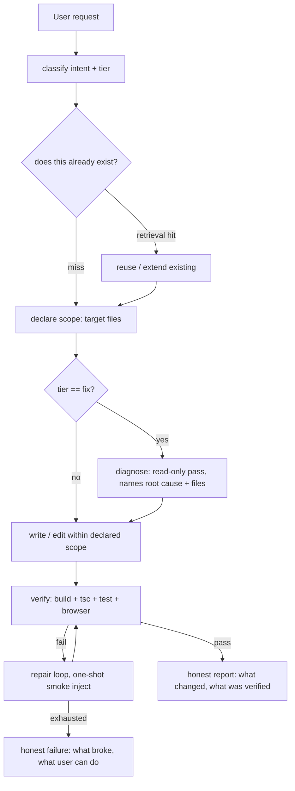

# Agent orchestration stability

## Problem

The EcomGear website-building agent works on the happy path but fails in five
repeatable ways that users feel directly:

1. **False success.** It says "Fixed!" or "Done" when the page is still broken.
2. **Scope wandering.** Asked to change a logo, it edits unrelated files chasing
   pre-existing errors, burns its step budget, lands nothing (the 2026-08 logo
   incident).
3. **Rebuilds what exists.** Reinvents auth/helpers/components already in the
   project (the reinvented-auth pattern across 6 projects).
4. **No real verification.** Until this session its only signals were "does it
   compile" and "did #root get children" — it could never run the thing.
5. **Opaque/dishonest output.** Failures surface as bare "Cancelled." or a
   confident lie; the user cannot tell what actually happened.

The root is the same in every case: **the loop is not grounded in real tool
feedback.** When the agent cannot check reality, the model substitutes
narration for evidence. Claude Code is stable precisely because its loop is
grounded — it runs the real thing, reads the real output, streams what it did
honestly, and edits a scoped surface. This design ports that grounding.

Foundation already shipped this session (verified, deployed): the agent can now
run tests / `tsc` / vitest (`run_command.ts`, gap G1), new projects scaffold a
test setup and fix-tier is asked for evidence (G7), the browser smoke check
went from observability-only to a repair trigger across ~84% of runs (G2/G3),
and the VPS5 edge-function sandbox escape is mitigated (S4). This design covers
the **remaining** stabilization architecture that makes those foundations add
up to a coherent, stable loop.

## Reference architecture — Claude Code, mapped to the four axes

The user named four axes. Each maps to a Claude Code property and an EcomGear
gap.

| Axis | Claude Code property | EcomGear gap today |
|------|----------------------|--------------------|
| **How code is written** | Read-first, single writer, minimal targeted edits, every write verifiable | Single-writer holds (one `streamText` loop) but no read-fan-out for exploration; verification only just arrived (G1) |
| **Where change happens** | Scoped to the task; model declares intent; edits the minimal surface | No enforced file scope by default (`declare_scope` exists but opt-in/soft-warn); Fix Mode scope creep |
| **Where searching happens** | grep/glob/read + read-before-write, increasingly semantic | grep/glob/`search_codebase`/embeddings all live, but nothing *requires* consulting them before creating new code (G22) |
| **How output is shown** | Streams tool activity, shows results, honest about done-vs-not | Streams activity, but false "Fixed!"/bare "Cancelled" reach the user (G31); real-signal gating landed this session |

The target loop (grounded ReAct), one writer, read-only fan-out:

The diagram shows the intended per-request control flow.

Single-writer / read-fan-out is the one hard invariant (Cognition + Anthropic
both converge here): mutation tools live in exactly one loop; any extra agent or
pass is read-only and reports findings back, never patches in parallel. EcomGear
already satisfies this; the risk is a future "verification agent" or "diagnosis
agent" being given write tools. The design keeps every added pass read-only.

## Goals / Non-goals

- **Goals:**
  - Make every user-visible success claim backed by a real signal, and every
    failure surfaced in plain language with a next step.
  - Enforce where change happens (declared scope) on the tier where wandering
    hurts most (fix), seeded from a read-only diagnosis pass.
  - Require a retrieval consult before creating net-new code that likely exists,
    measured before enforced.
  - Give the platform eyes: alerting on provider outage / sustained failure, so
    "the agent is acting weird" is never the first detector again.
  - Reduce prompt bloat and make tier routing correctable mid-run.
- **Non-goals:**
  - Multi-agent concurrent writes. Single writer stays the invariant.
  - Rebuilding checkpoints/snapshots/tier concept/prompt caching (all correct).
  - Full e2e / visual-diff verification (the binary smoke check is the right rung).
  - The isolated-vm port for VPS5 (tracked separately as the complete S4 fix).
  - Re-doing G1/G7/G2/G3/S4 — shipped this session, foundation only.

## Approaches

The question is how much orchestration structure to add, and where.

| # | Approach | Pros | Cons |
|---|----------|------|------|
| A | **Prompt-only** — push all discipline into prompt instructions (scope, retrieval, honesty) | Cheapest; no code | Already tried; the model ignores instructions under pressure — the logo incident happened *with* a scope-discipline prompt. Not grounded. |
| B | **Harness-enforced, incremental** — each axis becomes a mechanical gate in the existing single loop; ship one at a time, real-signal-gated | Grounded in mechanism not model goodwill; reuses the loop; matches the discipline that has worked this session; independently shippable/reversible | More code than A; must avoid false-positive gates that block legit work |
| C | **Full sub-agent orchestration rewrite** — separate planner/searcher/writer/verifier agents with a message bus | Clean separation; mirrors big-agent systems | Highest blast radius on a live paying platform; violates single-writer if done wrong; the loop already works — a rewrite risks regressing the stable happy path |

## Recommendation

**Approach B — harness-enforced, incremental.** Every axis becomes a mechanical
gate inside the existing single `streamText` loop, shipped one checkpoint at a
time, each real-signal-gated so a healthy run is byte-identical to today.

Rationale, from this session's evidence:

- The failures are *mechanical* failures of grounding, and every durable fix
  this session was a mechanism, not a prompt: the mutation circuit breaker
  (`agentLoopService.ts` `MUTATION_TOOLS`), the real-signal claim gates
  (`ctx.lastBuildErrorsHealthy`), the smoke→repair injection. Prompt-only (A)
  is disproven by the logo incident, which happened with the discipline prompt
  already in place.
- A rewrite (C) risks the one thing that currently works — the happy-path build
  loop — on a platform with live paying customers. The `PREVIEW_CHILD_PROCESS_MODE`
  comment in `server.js` already warns against exactly this kind of blind global
  flip.
- Increment discipline is proven: this session shipped four gaps to production
  one at a time, each verified against real data, without a regression.

Scope enforcement rides the `declare_scope` tool that already exists
(`agent-tools/declare_scope.ts`, built in the harness-redesign increment 2) and
the diagnose-before-fix pass (increment 3) — this design turns them from
opt-in/soft to enforced-on-fix-tier, seeded by diagnosis. Retrieval enforcement
is measured before it is enforced (the 2026-08-09 backlog instruction:
"measure before building anything") because a false retrieval gate would block
legitimate net-new code.

Sequencing rationale (cheapest/lowest-blast-radius first, honesty before
enforcement so the user always sees the truth even mid-migration):

1. **Honest output (G31)** — pure UX, no infra dep, highest churn-prevention.
2. **Alerting (G26)** — independent, small, its absence already cost 11h+ of
   silent outage more than once.
3. **Declared scope enforced on fix tier (G-scope)** — reuses built tool +
   diagnosis pass; the direct fix for the wandering incident.
4. **Retrieval measurement then gate (G22)** — measure first, enforce only if
   the data shows the agent skips existing code.
5. **Prompt chunking (G16)** — cost + focus; larger, mechanical.
6. **Tier routing robustness + mid-run re-tier (G19/G20)** — last; changes what
   a tier selects, so it lands after chunking.

## Open questions

- Retrieval gate (G22): what's the real skip rate? Must be measured on live runs
  before deciding enforce-vs-nudge. The gate design is contingent on that number.
- Alerting sink: webhook to where? (Slack / email / a status row the admin panel
  reads.) Needs one product decision on destination.
- Mid-run re-tier (G20): does raising a budget mid-run risk cost blowout? Bound
  by the existing USD cap, but the re-tier trigger needs a conservative default.
